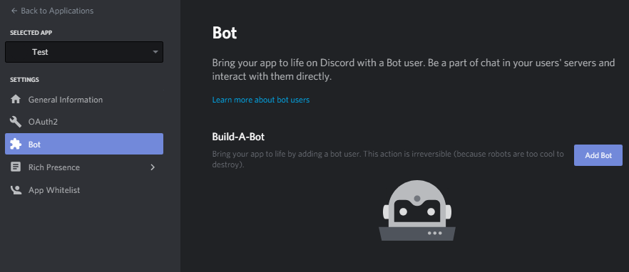
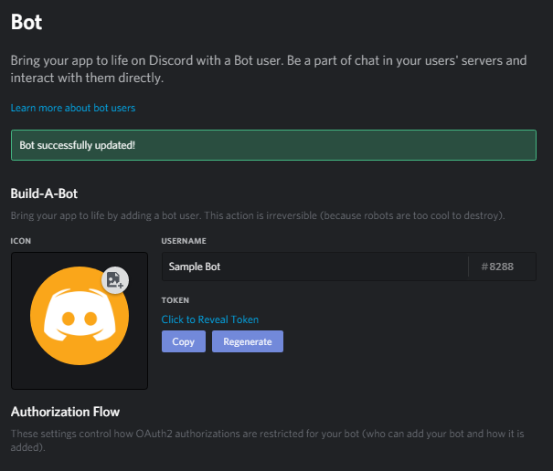
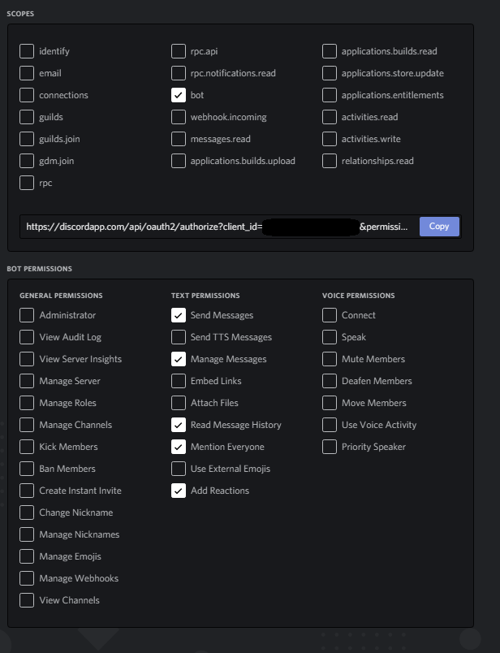

# Discord-Event-Coordinator

## Setup

The bot requires [Node.js](https://nodejs.org/) to run. Node.js is a free and open source JavaScript runtime. The package manager npm is used to install dependencies. Install both before continuing. To utilize the bot, a [Discord account](https://discordapp.com/). Log in to your account or create a new one. Additionally, the bot requires a MySQL server to store message info.

Once signed in, [create an applcation on Discord](https://discordapp.com/developers/applications/me). Select *New Application*. After inputting a name, on the right hand side, select *Bot*. Click *Add Bot*.



Copy the Bot's token by hitting *Copy* or *Click to Reveal Token*. This token will be used later for authorization.



On the right hand side, select *OAuth2*. Select *bot* under *Scopes*. Select *Send Messages*, *Manage Messages*, *Read Message History*, *Mention Everyone*, and *Add Reactions* under *Bot Permissions*. The link generated will be used to invite the bot to servers.



In your computer's "Command Prompt", navigate to the folder containing the [bot.js](bot.js) file. Perform the following commands to install dependencies.
```
npm install --all
```

Create a new file named auth.json. See [auth-sample](auth-sample.txt) for an exmaple. Set the "token" field to the value of your bot's token from earlier. "db_host" is the address for the MySQL database server. "db_user" is the role within the database. "db_pw" is the password used to connect to the MySQL database server. "db_name" is the name of the database the bot will use.
Another example:
```javascript
{
	"token": "Noijw82nfiaoIJOIdaj82jdOIjd82afj.fja9fj(9jajf29fjaf0asdif-g",
	"db_host": "127.0.0.1",
	"db_user": "root",
	"db_name": "discordbotMessagesDB"
}
```

Once the bot has been invited to a server and the auth.json file has been configured. Execute ```node bot.js DATABASEPASSWORD``` in the "Command Prompt" window.